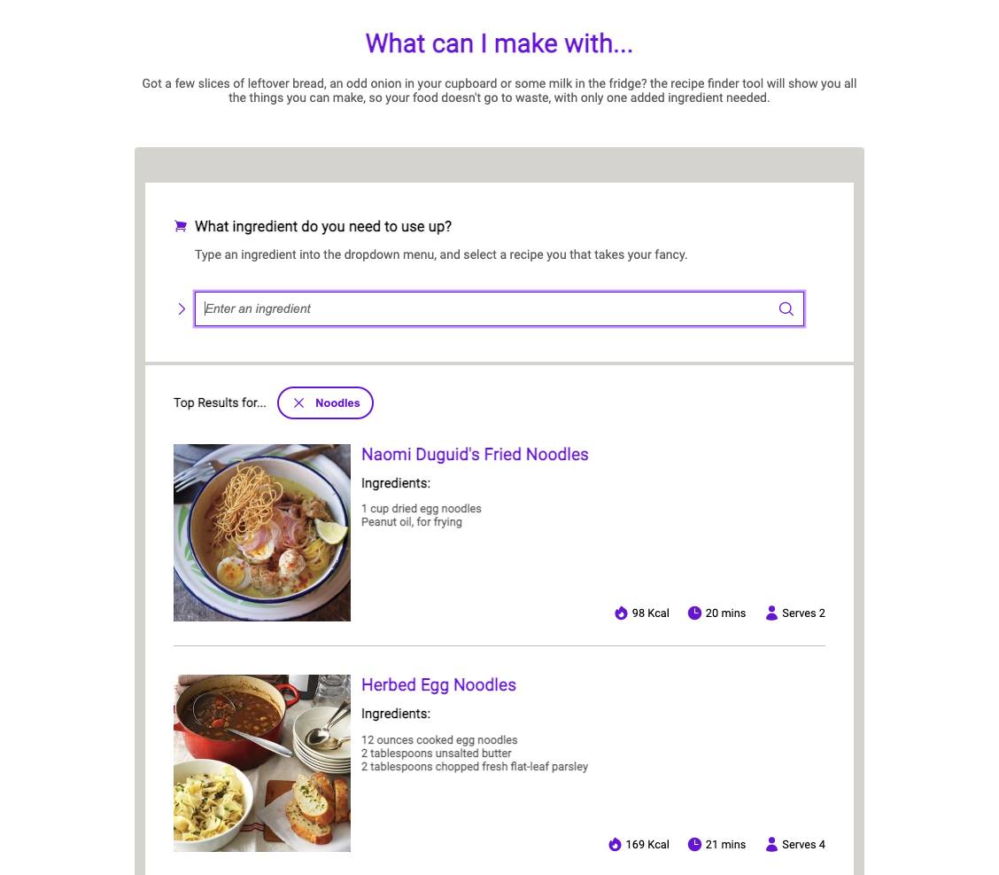

# The Recipe finder

Do you have an ingredient you want to cook with, but are stuck for ideas? If so, put it into the recipe finder and you'll be spoilt for choice. 

This app was developed using react & Typescript as a way of developoing Typescript skills.

## Functionality

This app takes advantage of the Edamam API. The current functionality is as follows:

- Search for a recipe by inputting an ingredient.
- View Recipe suggestions: Name, ingredients, image, calories, cooking time, and servings.
- Clicking on title or image will take you through to the recipe page for more details
- Clear search
- Scrollable ingredients section

## Skills Learned and used

**TypeScript**
- types: used for passing props
- interfaces: used for giving values to the data used from the API request
- Assigning types to variables

**React**
- **Hooks** useState & useEffect
- Passing Props
- Seperating components
- **Event Handlers**: onClick, onSubmit, onChange
- Dynamic rendering
- Async & Await API requests
- Map() 
- Conditional rendering

**Styling**
- CSS selectors: :focus :hover :last-child
- Hero Icons
- Google Fonts
- **Scrolling Recipe List**: Overflow: auto
- **CSS Variables**: accent color & text color

## Future implementations

- Refine search by entering more than one ingredient
- Enter health requirements: vegan, gluten free, etc.
